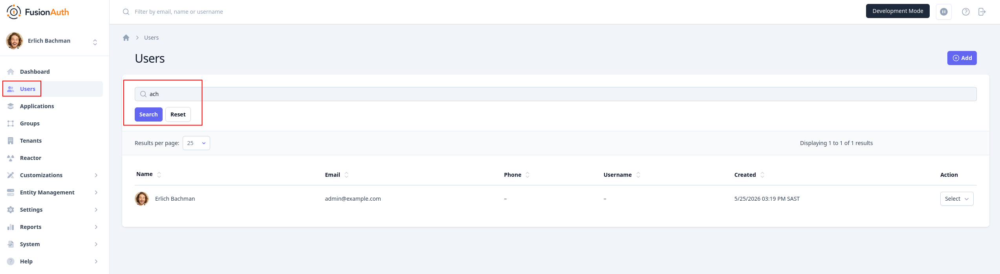
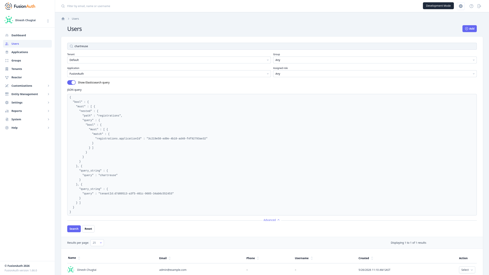

import Aside from 'src/components/Aside.astro';
import Breadcrumb from 'src/components/Breadcrumb.astro';
import ElasticsearchVersion from 'src/content/docs/_shared/_elasticsearch-version.mdx';
import ElasticsearchRam from 'src/content/docs/_shared/_elasticsearch-ram.mdx';

This page explains how to configure simple database search for FusionAuth, or install Elasticsearch or OpenSearch for more powerful features. If you instead want to know how to *use* FusionAuth search, please see the following documentation:

- [Manage users](/docs/lifecycle/manage-users/search/)
- [Search with Elasticsearch](/docs/lifecycle/manage-users/search/user-search-with-elasticsearch#an-introduction-to-the-elasticsearch-search-engine)
- [User API](/docs/apis/users#search-for-users)

FusionAuth natively provides a basic database search to find Users or Entities by simple fields like username or email address, including the ability to search by partial words.



As well as being used in the FusionAuth web interface, search is also available in the API.

Switching to Elasticsearch or OpenSearch provides features that the database search does not support, like:

- Elasticsearch query strings or JSON queries
- Searches on custom `user.data` fields
- Regex, ranges, and complex compound queries



<Aside type="note">
FusionAuth supports Elasticsearch and OpenSearch with the same features. You can choose either brand. This guide uses "Elasticsearch" as a general term for both.
</Aside>

## Should You Use Database Search or Elasticsearch?

For queries on simple user fields the database search is incredibly fast, as the search runs on indexed database fields. You should definitely choose database search unless you need to run complex searches or search the `user.data` field.

Switching to Elasticsearch will require more RAM, more CPU (for continuous indexing even if you aren't currently searching), and disk space of about 1.4 times your user data in the database expanded into the search index (though this can vary significantly). Elasticsearch also takes a little time to synchronize its index with the user database. So there might be small intervals when your search results don't represent the current users in the database.

<ElasticsearchRam />

You can switch your search provider freely and as often as you like. It's as simple as changing your Docker compose file, which is shown below.

## Configuring Database Search

The example Docker Compose files for FusionAuth in the [install](/docs/get-started/download-and-install/docker) and [start here](/docs/get-started/start-here/step-1) documentation include Elasticsearch.

To see a minimal Compose example without Elasticsearch, please review the ["light" example](https://github.com/ritza-co/fusionauth-example-docker-compose/blob/main/light/docker-compose.yml) in GitHub.

The light example has images only for FusionAuth and PostgreSQL. You can see in the `fa` service's `environment` variable the setting to use database search:

```yaml
SEARCH_TYPE: database
```

If you already have an instance of FusionAuth running Elasticsearch, changing the line above and restarting FusionAuth is all you need to do to switch to database search. You can then delete your Elasticsearch instance without affecting FusionAuth.

If you're running FusionAuth directly on your machine without Docker, you can change this environment variable directly on your host machine.

## Configuring Elasticsearch

Switching from database search to Elasticsearch reverses the process above. Here is an example [Docker Compose file that uses OpenSearch](https://github.com/ritza-co/fusionauth-example-docker-compose/blob/main/kickstart/docker-compose.yml).

Notice that the `environment` variables are now:

```yaml
SEARCH_TYPE: elasticsearch
SEARCH_SERVERS: http://search:9200
```

The new setting, `SEARCH_SERVERS`, tells FusionAuth on which URL to call Elasticsearch. The network address here is `search`, which is the name of the Elasticsearch container in the Compose file. Both FusionAuth and Elasticsearch need to be on the same network, which in this file is called `search_net` and is separate from the database network, called `db_net`. You could also use the same network for all components, or your host network.

<Aside type="note">
Elasticsearch does not query the database directly and gets user data only through FusionAuth. However, the data transfer process is [asynchronous since version 1.30.2](https://github.com/FusionAuth/fusionauth-issues/issues/599) and doesn't cause user login delays.
</Aside>

In addition to the two settings above, you need to have an instance of Elasticsearch running. In this example, OpenSearch is running in Docker on the same machine as FusionAuth, but you can run Elasticsearch anywhere on the network. Please consult the external Elasticsearch documentation to customize your search server.

After installing Elasticsearch, you must also tell it to index all the data in FusionAuth. Do so by browsing to <Breadcrumb>System -> Reindex</Breadcrumb>.


It's an easy mistake to install Elasticsearch and forget to toggle your `SEARCH_TYPE` variable or forget to restart FusionAuth. You can verify which type of search your FusionAuth instance uses by browsing to <Breadcrumb>System -> About</Breadcrumb>.


Elasticsearch may be horizontally scaled using Elasticsearch clustering. You can use multiple comma-separated search URLs with FusionAuth, as shown below:

```yaml
SEARCH_SERVERS: http://search:9200,http://search2:9200
```

These URLs must point to multiple Elasticsearch instances in the same cluster. FusionAuth will fail to start if you try to run completely separate Elasticsearch nodes both using FusionAuth.

<ElasticsearchVersion />
